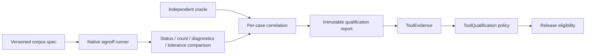

# ElectricalSignoffEngine Design

## Purpose

Power-integrity and electrical-reliability analysis over shared extracted topology.

## Responsibility boundary

This package owns the schemas and engine protocols listed in its public products. It must remain usable without UI state and without the Xcircuite runtime.

## Non-responsibilities

- Routing or layout mutation
- Geometric DRC primitives
- Final release approval

## Dependency direction

```text
standard artifacts / canonical references
                 ↓
ElectricalSignoffEngine protocols and result schemas
                 ↓
native or external-tool backends
                 ↓
Xcircuite stage adapters
                 ↓
DesignFlowKernel and .xcircuite artifacts
```

Backends may depend on lower-level data packages. This package must never import `Xcircuite` or `circuit-studio`.

The native backend accepts two explicit lanes: a verified canonical topology JSON artifact, or a verified JSON source bundle containing LogicDesign, PhysicalDesign, PowerIntent, PDK, canonical PEX and an electrical extraction profile. The source extractor preserves routed geometry and connectivity and blocks when current, layer, device or process semantics are unavailable. It does not silently treat GDS/OASIS bytes as electrical semantics; binary layout conversion remains an upstream adapter responsibility.

## Trust model

Kernel availability, corpus validation, oracle correlation, process-scoped qualification and release approval are distinct states. The package reports capability and evidence; Xcircuite and ToolQualification apply flow policy.

## Artifact requirements

All outputs are immutable run artifacts with format, digest, producer metadata and the input design/PDK revision needed to reproduce the result.

`LocalElectricalArtifactStore` writes report JSON under `.xcircuite/runs/<run-id>/electrical-signoff/`; `InMemoryElectricalArtifactStore` is available for unit tests and injected adapters. Neither store changes the design or layout.

## Qualification boundary



The runner records native artifacts and oracle observations in each case result. A native-only pass is corpus evidence; it is not process qualification. The release layer must supply a real PDK scope, fresh evidence and an independent oracle before selecting a production policy.
