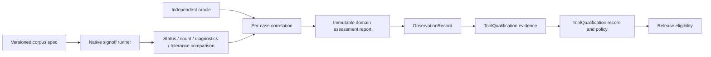

# ElectricalSignoffEngine Design

## Purpose

Power-integrity and electrical-reliability analysis over shared extracted topology.

## Responsibility boundary

This package owns the schemas and engine protocols listed in its public products. It must remain usable without UI state and without the Xcircuite runtime.

## Non-responsibilities

- Routing or layout mutation
- Geometric DRC primitives
- Final release approval

## Dependency direction

```text
standard artifacts / canonical references
                 ↓
ElectricalSignoffEngine protocols and result schemas
                 ↓
native or external-tool backends
                 ↓
Xcircuite composition and stage execution
                 ↓
DesignFlowKernel and .xcircuite artifacts
```

Backends may depend on lower-level data packages. This package must never import `Xcircuite` or `circuit-studio`.

The native backend accepts two explicit lanes: a verified canonical topology JSON artifact, or a verified JSON source bundle containing LogicDesign, PhysicalDesign, PowerIntent, PDK, canonical PEX and an electrical extraction profile. The source extractor preserves routed geometry and connectivity and blocks when current, layer, device or process semantics are unavailable. It does not silently treat GDS/OASIS bytes as electrical semantics; binary layout conversion remains an upstream adapter responsibility.

## Trust model

Kernel availability, corpus validation, oracle correlation, process-scoped qualification and release approval are distinct states. The package reports capability and evidence; Xcircuite and ToolQualification apply flow policy.

## Artifact requirements

All outputs are immutable run artifacts with format, digest, producer metadata and the input design/PDK revision needed to reproduce the result.

Every axis result binds its exact input artifact set, in-process invocation,
environment fingerprint, implementation version, and executable SHA-256. The
aggregate result records the same input set and lists every axis producer as a
supporting tool. Artifact references carry the producer that emitted their
bytes. Decoding or release consumption must reject missing identity fields,
producer mismatches, or artifacts that are not bound to the retained execution.

`LocalElectricalArtifactStore` receives an artifact root and
`ElectricalArtifactNamespace`. It validates every namespace, run, axis, and
artifact path segments, rejects traversal and symbolic-link escapes, and
creates each report path once using a completed temporary file and an atomic
hard-link create. The root is revalidated before and after directory creation
so a late symbolic-link or non-directory replacement is rejected. Identical repeated content is a typed duplicate
error; different content at the same path is a typed conflict.
`InMemoryElectricalArtifactStore` enforces the same immutability contract.
Neither store owns `.xcircuite`, run lifecycle, approval, resume, design, or
layout state.

## Qualification boundary



The runner records native artifacts and oracle observations in each case result.
An oracle observation is independent only when its immutable qualification
artifact binds a distinct oracle binary and exact input/output artifacts to the
same process scope. A native-only pass is corpus evidence; it is not process
qualification.
