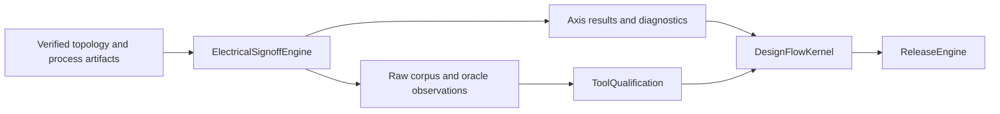

# ElectricalSignoffEngine

Native power-integrity and electrical-reliability analysis over canonical,
artifact-bound topology.

## Responsibility

| Product | Responsibility |
|---|---|
| `ElectricalSignoffCore` | Requests, topology, process rules, payloads, artifact access |
| `PowerIntegrityEngine` | Static/dynamic IR analysis and EM checks |
| `ERCEngine` | Electrical rule checking |
| `ESDEngine` | ESD path and clamp validation |
| `LatchUpEngine` | Well, substrate, and latch-up analysis |
| `AgingEngine` | NBTI, HCI, and TDDB lifetime projection |
| `ElectricalSignoffEvidence` | Raw corpus and independent-oracle observations |
| `ElectricalSignoffEngine` | Foundation-conforming umbrella engine |
| `electrical-signoff` | Standalone developer and Agent CLI |

`ElectricalTopology` binds design, layout, PDK, power intent, and parasitic
identity. Requests carry explicit operating conditions with PDK corner,
temperature, voltage scale, and activity scale. Results preserve every corner
and expose typed violations, blocked states, provenance, and immutable
artifacts.

## Ownership boundary



The engine measures and reports. It does not assign tool trust, approve a flow
transition, or authorize release. `ToolQualification` evaluates corpus and
independent-oracle observations. `DesignFlowKernel` owns run lifecycle,
approval, resume, retry, and cancellation. `ReleaseEngine` owns final release
authorization.

Artifact stores receive an explicit artifact root and typed namespace. They
validate run, axis, and artifact path segments, reject symbolic-link escapes,
and enforce immutable creation. This package never chooses a `.xcircuite`
directory or owns a run ledger.

## CircuiteFoundation boundary

`ElectricalSignoffExecuting` refines
`CircuiteFoundation.Engine<ElectricalSignoffRequest, ElectricalSignoffRunResult>`.
`ElectricalSignoffRunResult` directly exposes `ArtifactReference`,
`ExecutionProvenance`, `EvidenceManifest`, and `DesignDiagnostic` values.
Xcircuite invokes the published protocol directly.

`ElectricalSignoffEngineAPI.capabilitySnapshot` describes implemented analysis
axes and execution boundaries. It reports capabilities, not qualification.
External process-specific implementations are injected through
`ExternalElectricalSignoffRunning`.

## Corpus observations

`ElectricalSignoffCorpusSpec` declares cases, expected execution status,
violation counts, diagnostic codes, and metric tolerances.
`ElectricalSignoffCorpusRunner` emits `ElectricalSignoffCorpusReport` with raw
case measurements and `ElectricalSignoffObservationMaturity`.
`LocalElectricalSignoffOracle` loads an immutable
`ElectricalSignoffOracleObservationSet` for independent correlation. Oracle
independence is never inferred from a display name.

The checked-in fixtures are process-independent contract data. Together with the
contract tests, they cover parsing, analysis, artifact integrity, and observation
correlation; they do not establish foundry acceptance or release eligibility.

## CLI

```bash
swift run electrical-signoff \
  --request request.json \
  --project-root . \
  --pretty

swift run electrical-signoff \
  --request request.json \
  --extract-topology \
  --project-root . \
  --output electrical-topology.json

swift run electrical-signoff \
  --corpus-spec Fixtures/electrical-signoff-runnable-spec-v1.json \
  --project-root . \
  --pretty
```

The CLI returns `0` for a completed passing analysis or matching corpus, `2`
for completed analysis with violations or blocked observations, and `1` for
invalid input or execution failure. Reports are written under
`<project-root>/artifacts/electrical-signoff/<run-id>/`. Library consumers
inject the artifact root and namespace appropriate to their runtime.
`--allow-unverified-inputs` is limited to local exploration.

## Xcircuite integration

Xcircuite invokes the public engine protocols directly and owns concrete
`.xcircuite` persistence. It may persist the domain result, Foundation evidence,
corpus report, and repair plan as immutable run artifacts. The engine package
does not depend on Xcircuite; Xcircuite composes it through the published protocol.

## Build and test

`Package.swift` resolves each dependency independently. A local sibling is used
when its `Package.swift` exists; otherwise SwiftPM uses the pinned GitHub
revision. Xcircuite or another umbrella checkout is not required.

| Dependency | Local sibling | Remote fallback revision |
|---|---|---|
| CircuiteFoundation | `../CircuiteFoundation` | `2ec6ee13a89ac6885be3c26b41a9ee0ef89948ac` |
| LogicDesign | `../LogicDesign` | `698e54a6861cee247969d89df946d3b0f53c28ca` |
| PDKKit | `../PDKKit` | `b0d0ab30b044266e1ce3bd008dcec844e51f2302` |
| PhysicalDesignEngine | `../PhysicalDesignEngine` | `e02131875720eb78fa5789e433af22745ea63e9f` |
| PEXEngine | `../PEXEngine` | `f3078e12af274a714e27ec523f19c5c29abd42dd` |

```bash
xcodebuild -scheme ElectricalSignoffEngine-Package -destination 'platform=macOS' build
xcodebuild -scheme ElectricalSignoffEngine-Package -destination 'platform=macOS' test
```

The package uses Swift Testing. Tests cover native axes, topology extraction,
Foundation integration, raw corpus observations, and oracle correlation.

See `DESIGN.md`, `INTERFACES.md`, `IMPLEMENTATION_PLAN.md`, and `MILESTONES.md`
for the package contracts and remaining work.
