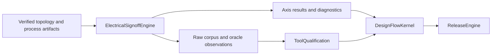

# ElectricalSignoffEngine

Native power-integrity and electrical-reliability analysis over canonical,
artifact-bound topology.

## Responsibility

| Product | Responsibility |
|---|---|
| `ElectricalSignoffCore` | Requests, topology, process rules, payloads, artifact access |
| `PowerIntegrityEngine` | Static/dynamic IR analysis and EM checks |
| `ERCEngine` | Electrical rule checking |
| `ESDEngine` | ESD path and clamp validation |
| `LatchUpEngine` | Well, substrate, and latch-up analysis |
| `AgingEngine` | NBTI, HCI, and TDDB lifetime projection |
| `ElectricalSignoffEvidence` | Raw corpus and independent-oracle observations |
| `ElectricalSignoffEngine` | Foundation-conforming umbrella engine |
| `ElectricalSignoffCLICore` | Protocol-first command parsing and reusable CLI execution |
| `electrical-signoff` | Standalone developer and Agent CLI |

`ElectricalTopology` binds design, layout, PDK, power intent, and parasitic
identity. Requests carry explicit operating conditions with PDK corner,
temperature, voltage scale, and activity scale. Results preserve every corner
and expose typed violations, blocked states, provenance, and immutable
artifacts.

Execution evidence is fail-closed: every axis records the exact inputs,
invocation, environment fingerprint, implementation version, and executable
SHA-256. Output artifacts retain that producer identity, and the aggregate run
binds all axis producers as supporting tools.

Every axis also emits `AnalysisCoverage`, containing the exact expected and
analyzed entity IDs. A result can be `completed` only when both arrays are
non-empty, unique, canonically sorted, and identical, and when payload
provenance plus a persisted report artifact are present. Missing device aging
models, a powered domain without an ESD rail, an invalid clamp power/ground
binding, inconsistent well/contact ownership, or any other omitted entity
therefore produces a structured failure or `blocked` result without a passing
report artifact. Xcircuite release assembly checks the same coverage contract
for every operating condition.

## Ownership boundary


```mermaid
flowchart LR
    Inputs["Verified topology and process artifacts"] --> Engine["ElectricalSignoffEngine"]
    Engine --> Results["Axis results and diagnostics"]
    Engine --> Corpus["Raw corpus and oracle observations"]
    Corpus --> Trust["ToolQualification"]
    Results --> Flow["DesignFlowKernel"]
    Trust --> Flow
    Flow --> Release["ReleaseEngine"]
```

The engine measures and reports. It does not assign tool trust, approve a flow
transition, or authorize release. `ToolQualification` evaluates corpus and
independent-oracle observations. `DesignFlowKernel` owns run lifecycle,
approval, resume, retry, and cancellation. `ReleaseEngine` owns final release
authorization.

Artifact stores receive an explicit artifact root and typed namespace. They
validate run, axis, and artifact path segments, reject symbolic-link escapes,
and enforce immutable creation. This package never chooses a `.xcircuite`
directory or owns a run ledger.

## CircuiteFoundation boundary

`ElectricalSignoffExecuting` refines
`CircuiteFoundation.Engine<ElectricalSignoffRequest, ElectricalSignoffRunResult>`.
`ElectricalSignoffRunResult` directly exposes `ArtifactReference`,
`ExecutionProvenance`, `EvidenceManifest`, and `DesignDiagnostic` values.
Xcircuite invokes the published protocol directly.

`ElectricalSignoffEngine.capability` describes the
analysis axes implemented by `ElectricalSignoffEngine` and its execution
boundaries. It reports capabilities, not qualification.
External process-specific implementations conform directly to the axis
protocol they implement: `PowerIntegrityAnalyzing`, `ERCExecuting`,
`ESDExecuting`, `LatchUpExecuting`, or `AgingAnalyzing`. The package does not
provide a generic runner or an adapter layer between these protocols.

## Corpus observations

`ElectricalSignoffCorpusSpec` declares cases, expected execution status,
violation counts, diagnostic codes, and metric tolerances.
`ElectricalSignoffCorpusRunner` emits `ElectricalSignoffCorpusReport` with raw
case measurements and `ElectricalSignoffObservationMaturity`.
`LocalElectricalSignoffOracle` loads an immutable
`ElectricalSignoffOracleObservationSet` for independent correlation. Oracle
independence is never inferred from a display name.

The checked-in fixtures are process-independent contract data. Together with
the contract tests, they cover canonical JSON logic/physical/process input,
standard SPEF parasitics, exact entity mapping, malformed and incomplete
topology rejection, multi-corner analysis, every native axis, artifact
integrity, and observation correlation. Layout exchange parsing remains in its
owning packages; these fixtures do not establish foundry acceptance or release
eligibility.

## CLI

```bash
swift run electrical-signoff \
  --request request.json \
  --project-root . \
  --pretty

swift run electrical-signoff \
  --request request.json \
  --extract-topology \
  --project-root . \
  --output electrical-topology.json

swift run electrical-signoff \
  --corpus-spec Fixtures/electrical-signoff-runnable-spec-v1.json \
  --project-root . \
  --pretty
```

The CLI returns `0` for a completed passing analysis or matching corpus, `2`
for completed analysis with violations or blocked observations, and `1` for
invalid input or execution failure. Reports are written under
`<project-root>/artifacts/electrical-signoff/<run-id>/`. Library consumers
inject the artifact root and namespace appropriate to their runtime.
`--allow-unverified-inputs` is limited to local exploration.

## Xcircuite integration

Xcircuite invokes the public engine protocols directly and owns concrete
`.xcircuite` persistence. It may persist the domain result, Foundation evidence,
corpus report, and repair plan as immutable run artifacts. The engine package
does not depend on Xcircuite; Xcircuite composes it through the published protocol.

## Build and test

`Package.swift` resolves each dependency independently. A local sibling is used
when its `Package.swift` exists; otherwise SwiftPM uses the pinned GitHub
revision. Xcircuite or another umbrella checkout is not required.

| Dependency | Local sibling | Remote fallback revision |
|---|---|---|
| CircuiteFoundation | `../CircuiteFoundation` | `7abcac83517935c9b9f7553d7016d62cffde259d` |
| LogicDesign | `../LogicDesign` | `b0eff14c90faafb4e474ed629358c9f7c12d0ea6` |
| PDKKit | `../PDKKit` | `b62c5ad7e5819a24977038c2133856caed52f481` |
| PhysicalDesignEngine | `../PhysicalDesignEngine` | `a2b64a3f9f1651be0601496a7423a211c1438c49` |
| PEXEngine | `../PEXEngine` | `ba10c1fe0b847d5816faef4eae67c64a19d61e1e` |

```bash
xcodebuild \
  -workspace .swiftpm/xcode/package.xcworkspace \
  -scheme ElectricalSignoffEngine-Package \
  -destination 'platform=macOS' \
  build

xcodebuild \
  -workspace .swiftpm/xcode/package.xcworkspace \
  -scheme ElectricalSignoffEngine-Package \
  -destination 'platform=macOS' \
  test
```

The package uses Swift Testing. Tests cover native axes, topology extraction,
Foundation integration, raw corpus observations, oracle correlation, and
large-topology latency and determinism.

## Performance contract

The power-integrity solver builds lightweight per-run indexes of source, node,
segment, and load array positions. ERC and ESD build only the connection and
domain lookup values required by their own analysis. The canonical
`ElectricalTopology` remains the sole owned topology, so analysis indexes do
not become another public state model.

`PerformanceRegressionTests` exercises 8,000 independent power rails and 8,000
bidirectionally owned well contacts. The solver has a five-second debug-build
latency budget under the full parallel package test graph; validation has a
one-second budget. On the 2026-07-26 development host, the isolated solver
fixture improved from 34.247 seconds to 0.052 seconds and validation improved
from 2.213 seconds to 0.017 seconds. The solver completed in 1.571 seconds while
both Xcode test bundles ran concurrently. The solver fixture also requires
identical repeated solutions. These fixtures establish algorithmic regression
budgets, not foundry-scale memory qualification or accuracy correlation.

See `DESIGN.md`, `INTERFACES.md`, `IMPLEMENTATION_PLAN.md`, and `MILESTONES.md`
for the package contracts and remaining work.
